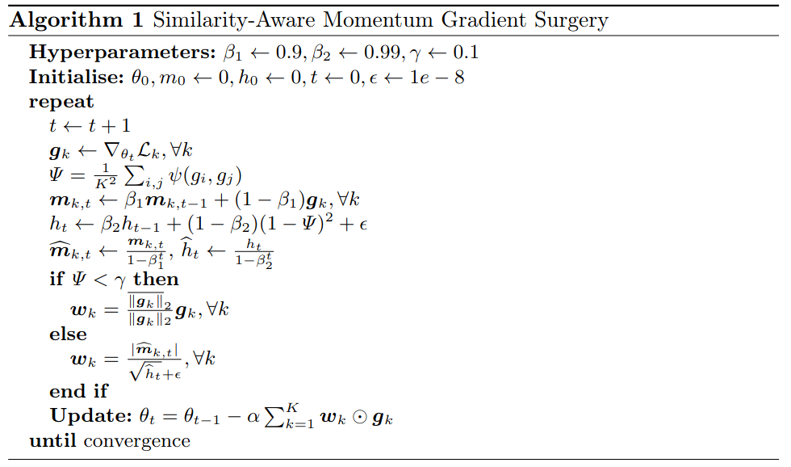

# Gradient Similarity Surgery in Multi-task Deep Learning
Official implementation of the **SAM-GS** optimizer for multitask learning

The multi-task learning (*MTL*) paradigm aims to simultaneously learn multiple tasks, within a single model, capturing higher-level, more general hidden patterns that are shared by the tasks. 
In deep learning, a significant challenge in the backpropagation training process is the design of advanced optimisers to improve the convergence speed and stability of the gradient descent learning rule. 
In particular, in multi-task deep learning (*MTDL*) the multitude of tasks may generate potentially *conflicting gradients* that would hinder the concurrent convergence of the diverse loss functions. 
This challenge arises when the gradients of the task objectives have either different magnitudes or opposite directions, causing one or a few to dominate or to interfere with each other, thus degrading the training process.
Gradient surgery methods address the problem explicitly dealing with conflicting gradients by adjusting the overall gradient trajectory.
This work introduces a novel gradient surgery method, the Similarity-Aware Momentum Gradient Surgery (**SAM-GS**), which provides an effective and scalable approach based on a gradient magnitude similarity measure to guide the optimisation process.
The **SAM-GS** surgery adopts gradient equalisation and modulation of the *first-order momentum*.
A series of experimental tests have shown the effectiveness of **SAM-GS** on synthetic problems and *MTL* benchmarks. Gradient magnitude similarity plays an important role in *regularising gradient aggregation* in *MTDL* for the optimisation of the learning process.

---

<p align="center"> 
    
</p>


Comparison of different MTL methods for 20000 steps.\\
**Top row**: The loss trajectories of different MTL methods in the loss space.\\
**Bottom row**: The loss trajectories of different MTL methods in the parameters space.\\

---

<p align="center"> 
    
</p>


## Image Experiments

### Setup environment

Create the environment and install dependecies
```bash
  $ cd samgs
  $ python3 -m venv myenv
  $ source myenv/bin/activate
  $ pip install -U pip
  $ pip install -r requirements.txt
  ```

### Download dataset

The datasets could be downloaded from [NYU-v2](https://www.dropbox.com/sh/86nssgwm6hm3vkb/AACrnUQ4GxpdrBbLjb6n-mWNa?dl=0) and [CityScapes](https://www.dropbox.com/sh/gaw6vh6qusoyms6/AADwWi0Tp3E3M4B2xzeGlsEna?dl=0). To download the CelebA dataset, please refer to this [link](https://drive.google.com/drive/folders/0B7EVK8r0v71pWEZsZE9oNnFzTm8?resourcekey=0-5BR16BdXnb8hVj6CNHKzLg). The dataset should be put under ```dataset/EXP_NAME/``` folder where ```EXP_NAME``` is chosen from ```nyuv2, cityscapes, celeba```.

The file hierarchy should look like
```
samgs             
 └─ dataset                       (the dataset folder containing the MTL data)
 └─ experiments
     └─ utils.py                  (for argument parsing)
     └─ nyuv2
         └─ conf 
         └─ trainer.py            (the main file to run the training)
     └─ cityscapes
         └─ conf                  (the configuration folder containing the experiments configuration)
         └─ trainer.py            (the main file to run the training)
     └─ celeba
         └─ conf                  (the configuration folder containing the experiments configuration)
         └─ trainer.py            (the main file to run the training)
     └─ toy1o
         └─ conf                  (the configuration folder containing the experiments configuration)
         └─ main.py               (the main file to run the training)
     └─ toy2o
         └─ conf                  (the configuration folder containing the experiments configuration)
         └─ main.py               (the main file to run the training)
 └─ methods
     └─ weight_methods.py         (the different MTL optimizers)
 └─ run.sh                        (the command to run experiments)
```

### Run experiment

To run experiments all the experiments it is possbile to use the ```run.sh```
```bash
bash run.sh
```
You can check the ```experiments/EXP_NAME/readme.md``` for details about training the supprted optimisers with **Hydra**.


### MTL methods

We support the following MTL methods with a unified API. To run experiment with MTL method `X` simply run:
```bash
python trainer.py --method=X
```

| Method (code name) | Paper (notes) |
| :---: | :---: |
| Aligned-MTL (`alignedmtl`) | [Independent Component Alignment for Multi-Task Learning](https://openaccess.thecvf.com/content/CVPR2023/papers/Senushkin_Independent_Component_Alignment_for_Multi-Task_Learning_CVPR_2023_paper.pdf) |
| FAMO (`famo`) | [Fast Adaptive Multitask Optimization](https://arxiv.org/abs/2306.03792.pdf) |
| Nash-MTL (`nashmtl`) | [Multi-Task Learning as a Bargaining Game](https://arxiv.org/pdf/2202.01017v1.pdf) |
| CAGrad (`cagrad`) | [Conflict-Averse Gradient Descent for Multi-task Learning](https://arxiv.org/pdf/2110.14048.pdf) |
| PCGrad (`pcgrad`) | [Gradient Surgery for Multi-Task Learning](https://arxiv.org/abs/2001.06782) |
| IMTL-G (`imtl`) | [Towards Impartial Multi-task Learning](https://openreview.net/forum?id=IMPnRXEWpvr) |
| MGDA (`mgda`) | [Multi-Task Learning as Multi-Objective Optimization](https://arxiv.org/abs/1810.04650) |
| DWA (`dwa`) | [End-to-End Multi-Task Learning with Attention](https://arxiv.org/abs/1803.10704) |
| Uncertainty weighting (`uw`) | [Multi-Task Learning Using Uncertainty to Weigh Losses for Scene Geometry and Semantics](https://arxiv.org/pdf/1705.07115v3.pdf) |
| Linear scalarization (`ls`) | - (equal weighting) |
| Scale-invariant baseline (`scaleinvls`) | - (see Nash-MTL paper for details) |
| Random Loss Weighting (`rlw`) | [A Closer Look at Loss Weighting in Multi-Task Learning](https://arxiv.org/pdf/2111.10603.pdf) |


## Multitask Reinforcement Learning (MTRL)
Following [CAGrad](https://github.com/Cranial-XIX/CAGrad), the MTRL experiments are conducted on [Metaworld](https://github.com/rlworkgroup/metaworld) benchmarks. In particular, we follow the [mtrl](https://github.com/facebookresearch/mtrl) codebase and the experiment setup in [this paper](http://proceedings.mlr.press/v139/sodhani21a/sodhani21a.pdf).

1. Install [mtrl](https://github.com/facebookresearch/mtrl) according to the instructions.

2. Git clone [Metaworld](https://github.com/rlworkgroup/metaworld) and change to `d9a75c451a15b0ba39d8b7a8b6d18d883b8655d8` commit (Feb 26, 2021). Install metaworld accordingly.

3. Copy the `mtrl_files` folder under mtrl of this repo to the cloned repo of mtrl. Then
```
cd PATH_TO_MTRL/mtrl_files/ && chmod +x mv.sh && ./mv.sh
```
Then follow the `run.sh` script to run experiments
